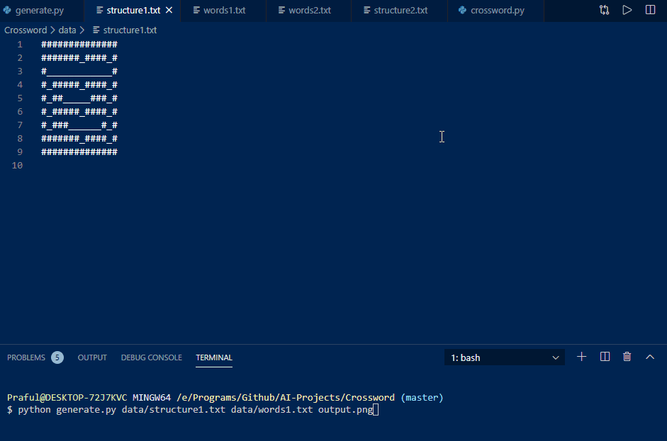

## Crossword
AI that solves crossword puzzles given a set of words and grid.

### How does it work?
Models the problem of solving crossword puzzles as a Constraint Satisfaction Problem. Imagine each variable(The row or column where you will assign a word) in the puzzle as a node. An edge is present between two or more nodes which have overlapping letters. Filter through the words by maintaining node consistency(word length matches the variable in the puzzle) and edge consistency(respect overlapping - letter matching) then backtrack to assign each variable of the puzzle a word.

### How to use it?
`$ git clone https://github.com/Praful932/AI-Projects.git`

`$ cd AI-Projects/Crossword`

`$ python generate.py data/structure1.txt data/words1.txt output.png`

To use your own puzzle, replace structure1.txt and words1.txt with the file you want.

