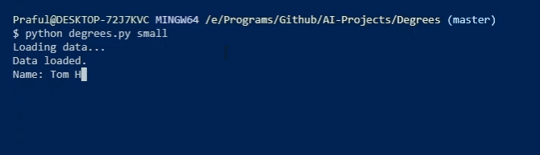

## Six Degrees of Kevin Bacon
Finds if two people are related directly or indirectly.

### How does it work?
Uses [Depth First Search](https://www.tutorialspoint.com/data_structures_algorithms/depth_first_traversal.htm) to find relation between two people.

### How to use it?
`$ git clone https://github.com/Praful932/AI-Projects.git`

`$ cd AI-Projects/Degrees`

To use the small database

`$ python degrees.py small`

To use the large database

`$ python degrees.py large`
