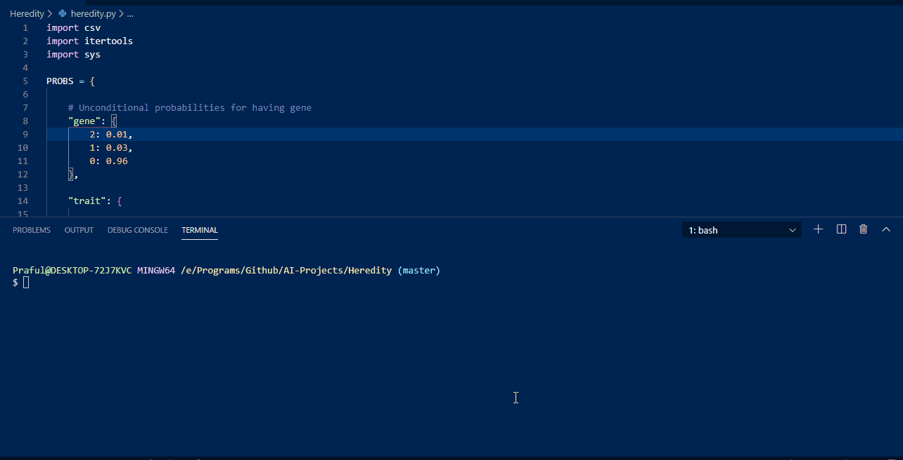
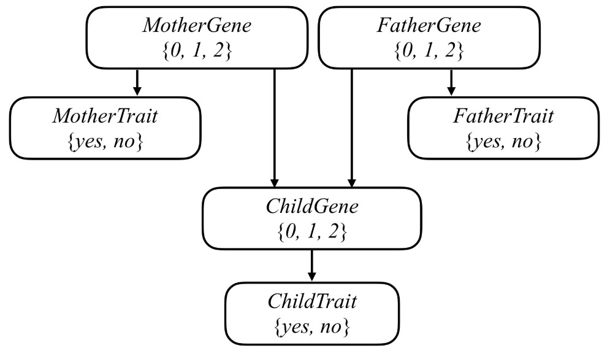

## Heredity
Find the probability that a person has mutated versions of the GJB2 gene(which causes hearing impairment in newborns).

### How does it work?
There are 3 csv files in `data/` directory each containing given data of 3 separate families. Using the given data and probabilities of the gene we calculate the probability that a person has 0/1/2 genes and has the trait or not.
This is done by representing it in terms of a [Bayesian Network](https://towardsdatascience.com/introduction-to-bayesian-networks-81031eeed94e).

### How to use it?
`$ git clone https://github.com/Praful932/AI-Projects.git`

`$ cd AI-Projects/Heredity`

`$ python heredity data/family0.csv`