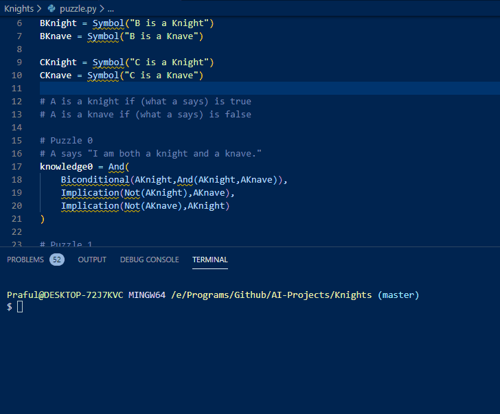

## Knights and Knaves
AI Solves [Knights and Knaves Puzzle](https://sites.google.com/site/newheiser/knightsandknaves) using Propositional Logic given Knowledge

### How does it work?
It uses Model Checking(iterates over all possibilites) to evaluate the answer given some query.
You can add more puzzles by adding a new Knowledge Base for each puzzle. 

### How to use it?
`$ git clone https://github.com/Praful932/AI-Projects.git`

`$ cd AI-Projects/Knights`

To run the puzzle solver

`$ python puzzle.py`
