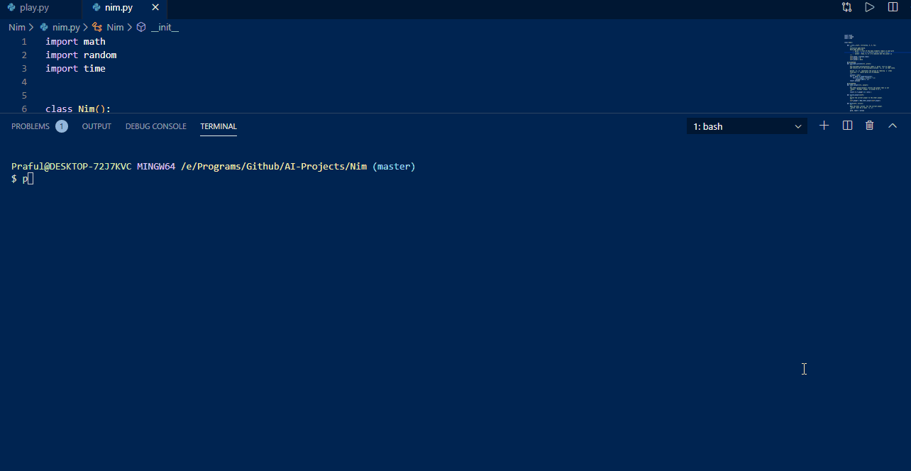

## Nim
AI Plays Nim with you

### How does it work?
The agent which plays with you is trained using Reinforcement Learning. It is first trained by playing 10000 games with itself. This AI is modelled using the Q-learning algorithm. The objective of the agent is to get as much reward as possible. It takes a best possible action depending upon the current state of the game to maximize the reward it gets.

### How to use it?
`$ git clone https://github.com/Praful932/AI-Projects.git`

`$ cd AI-Projects/Nim`

To run the game, Initially it will train itself which takes a bit of time.

`$ python play.py`
