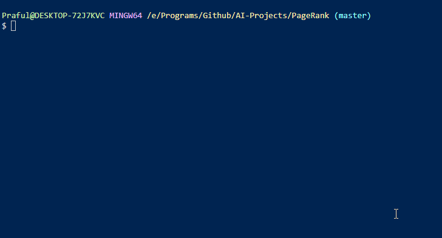

## PageRank Algorithm
The famous algorithm developed by Larry Page which is used in ranking web pages in their search engine results. To know 
more on that - [here](https://www.geeksforgeeks.org/page-rank-algorithm-implementation/).

### How does it work?
There are two approaches used in the current program, one is iterative approach other is Random Surfer Model approach.
Random Surfer basically is built on the idea that an important webpage has more links from other important pages which make
it important. Iterative approach defines a pages PageRank using a recursive mathematical expression.

### How to use it?

There are three folders each which contains set of webpages linked to each other. You can change the folder to be checked accordingly
as shown in the gif.

`$ git clone https://github.com/Praful932/AI-Projects.git`

`$ cd AI-Projects/PageRank`

To run the algorithm

`$ python pagerank.py corpus0`
