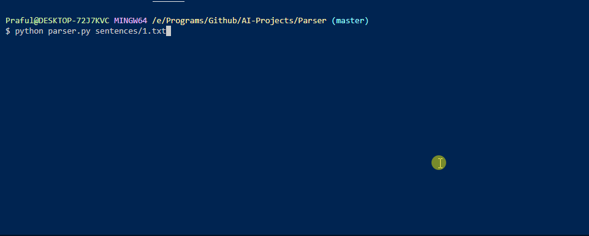

## Parser
Parses given sentences into a predefined grammatical structure

### How does it work?
Using the nltk package, with predefined grammar rules, the program figures out to structure the sentence ussing the given rules

### How to use it?
`$ git clone https://github.com/Praful932/AI-Projects.git`

`$ cd AI-Projects/Parser`

`$ python parser.py`

