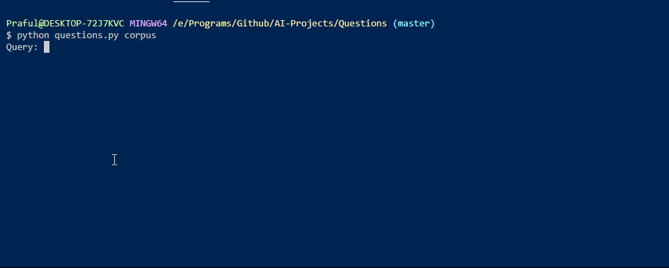

## Questions
NLP Tool that answers questions based on given data

### How does it work?
The AI is given a set of documents,which it scans for important words their term frequency and the inverse document frequency. When a query is given by the user, it searches for the highest ranking file according to [tf-idf](https://en.wikipedia.org/wiki/Tf%E2%80%93idf#:~:text=In%20information%20retrieval%2C%20tf%E2%80%93idf,in%20a%20collection%20or%20corpus.) after which returns the passage with the highest idf from the file.

### How to use it?
`$ git clone https://github.com/Praful932/AI-Projects.git`

`$ cd AI-Projects/Questions`

`$ python questions.py corpus`

