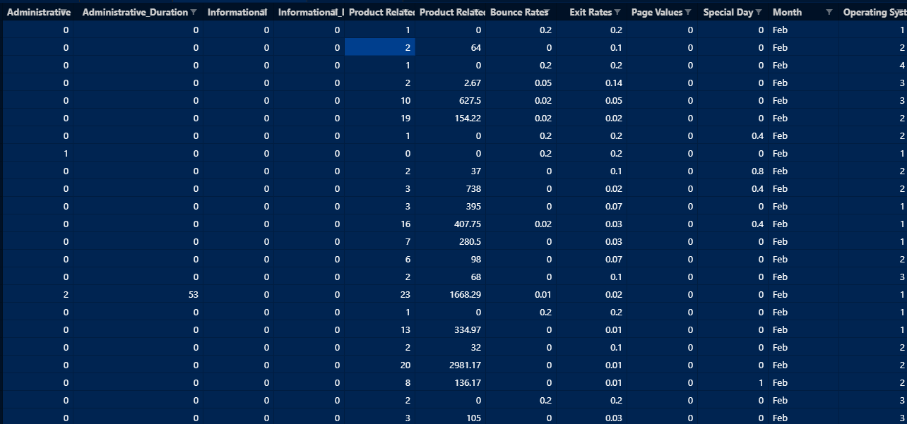

## Shopping
AI to predict whether the online shopping customers will complete a purchase or not

### How does it work?
Uses K-Nearest Neighbour to train the model based on evidence provided in the `shopping.csv`. The column `Revenue` in the dataset is want we want to predict and all the rest of the columns are features.

### How to use it?
`$ git clone https://github.com/Praful932/AI-Projects.git`

`$ cd AI-Projects/Shopping`

`$ python shopping.py shopping.csv`

