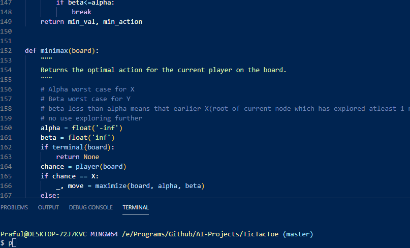

## Tic Tac Toe
The classic Tic Tac Toe game
(You vs The Bot)

### How does it work?
The bot uses the Minimax algorithm -  Maximize or Minimize the value by recursively finding the end result and making the move. It also uses alpha-beta pruning where alpha is the worst the maximizing player can take(-inf/nothing) and beta is the worst minimizing player can give(+inf/everything).

### How to use it?
`$ git clone https://github.com/Praful932/AI-Projects.git`

`$ cd AI-Projects/TicTacToe`

To play the game

`$ python runner.py`
